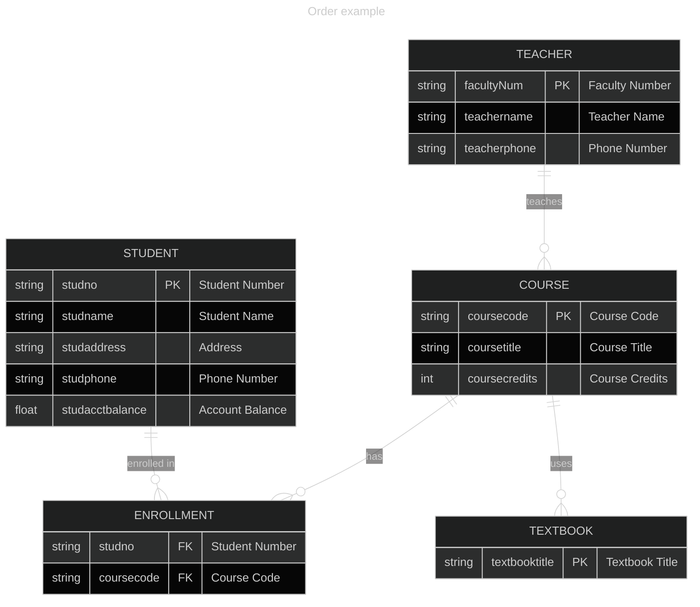

Topics: [[Technology]], [[Programming]]  
# External Schema
## User Requirements
#TODO/Writing-Prompt
## User Views
#TODO/Writing-Prompt
# Conceptual Schema
## Entities
Entities are real-world objects or concepts in a database. It's a table in relational databases. Each entity holds a set of attributes. You can think of entities as the rows in a spreadsheet or table.
Example: Artist, Album, Song, Customer, Order, Product
## Attributes
Attributes are properties or characteristics of an entity. You can think of attributes as the columns in a spreadsheet or table.
Example: An Artist will have a name, birthdate, genres.
## Cardinality
Cardinality is the associations between entities.
- One to One: A person can only have one passport.
- One to Many: A person can only be in one room, but many people can be in that room.
- Many to Many: A person can have multiple jobs. Jobs have many people.
- Recursion: A room connects to rooms connects to rooms.
It is better to use one to one where you can for efficient normalisation, but many to many can be used for edge case flexibility. IE: A bed can have one patient, a patient can have one bed. Theoretically you can have more people in one bed or one person with multiple beds, but it's better not to. These limitations are a way of increasing performance, security, and ease of audits.
## Conditionality
Conditionality are constraints on the data to enforce rules. IE: A bed may or may not have a patient assigned to it. A book must have at least one author.
## Relationship Degrees
The number of entities that participate in the relationship.
1. Unary: An employee who supervises other employees.
2. Binary: A customer who places an order.
3. Ternary: A supplier supplies a product to a customer.
  N. Higher: More than three.
## Entity Relationship Diagrams
ER Diagrams can visualise a database's logical design.
[Mermaid.js](https://mermaid-js.github.io/mermaid-live-editor) can generate ER diagrams.
## Mermaid.js Cardinalities Syntax
| Value (left) | Value (right) | Meaning                       |
| ------------ | ------------- | ----------------------------- |
| \|o          | o\|           | Zero or one                   |
| \|           | \|            | Exactly one                   |
| }o           | o{            | Zero or more (no upper limit) |
| }\|          | \|{           | One or more (no upper limit)  |
## Mermaid.js Chart Example

# Internal Schema
## Normalisation
**(1NF)**: Each table cell must contain a single value. No repeating groups or arrays are allowed.
**(2NF)**: Each non-key attribute in a table must depend on the entire primary key. In other words, if a table has multiple columns that are not part of the primary key, each of those columns should be dependent on all the columns in the primary key.
**(3NF)**: If a table is in 2NF and a non-key attribute depends on another non-key attribute, then it should be moved to a separate table.
## SQL Queries
#TODO/Writing-Prompt
```sql
--Example: List all courses
SELECT c.coursecode, c.coursetitle, c.coursecredits
FROM COURSE c;
--Example: Find all courses a student is in
SELECT c.coursecode, c.coursetitle, c.coursecredits
FROM COURSE c
JOIN ENROLLMENT e ON c.coursecode = e.coursecode
WHERE e.studno = '12345';
```
